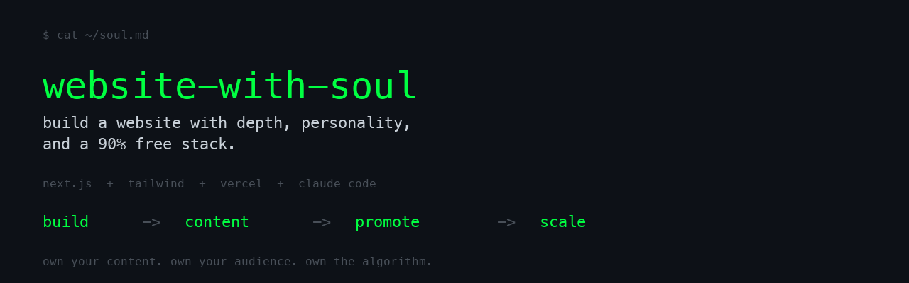

<p align="center">
  
</p>

<h3 align="center">搭建一个有深度、有个性的网站，90% 的工具免费。</h3>

<p align="center">
  <a href="LICENSE"></a>
  
  <a href="https://github.com/shawnla90/recursive-drift"></a>
  <a href="https://github.com/shawnla90/context-handoff-engine"></a>
</p>

[English](README.md) | **中文**

---

## 问题在哪

大多数个人网站和品牌网站都是空壳。一个落地页，一个联系表单，可能还有一个半年没更新的博客。它们存在着，但什么也没做。

与此同时，你却在别人的平台上经营自己的受众。LinkedIn 明天就可以限制你的曝光。Reddit 可以封禁你的账号。X 可以改算法。你在用别人的基础设施租借注意力。

## 核心理念

你可以用几乎全免费的工具搭建一个有灵魂的网站。一个听起来像你、搜索排名靠前、能被 AI 系统索引、并且随时间复利增长的网站。内容是你的。受众是你的。算法也是你的。

这个仓库给你两样东西：

1. **一套可用的入门模板** - 克隆下来 15 分钟就能跑起来
2. **一本 32 章的实战手册** - 教你完整体系：搭建、内容、推广、规模化

## 技术栈（90% 免费）

| 工具 | 费用 | 用途 |
|------|------|------|
| Next.js 15 | 免费 | 框架（App Router，静态生成） |
| Tailwind CSS v4 | 免费 | 样式 |
| Vercel | 免费 | 部署（Hobby 套餐） |
| Cloudflare | 约 $10/年 | 域名注册 |
| PostHog | 免费 | 数据分析（代理模式，防广告拦截） |
| Claude Code | 约 $200/月 | 构建工具（Max 订阅） |
| Remotion | 免费 | 视频/图片渲染（可选） |
| Midjourney | 约 $10/月 | 内容配图（可选） |

固定成本总计：域名每年约 $10。其他全免费或可选。

## 快速开始

### 路径一：15 分钟（入门模板）

```bash
git clone https://github.com/shawnla90/website-with-soul.git
cd website-with-soul/starter
npm install
npm run dev
```

打开 `http://localhost:3000`。你会得到一个完整可用的网站，包含：
- 暗色终端风格（在 `globals.css` 中自定义强调色）
- Markdown 博客系统（在 `content/blog/` 中添加 `.md` 文件）
- AI 聊天组件（在 `.env.local` 中填入你的 Anthropic API key）
- PostHog 数据分析（填入你的 key，或者跳过 - 网站没它也能正常运行）
- SEO 基础设施（站点地图、robots.txt、OG 图片、RSS 订阅）
- 安全响应头（CSP、X-Frame-Options，通过 middleware 配置）

### 路径二：1 小时（搭建 + 部署）

按照[实战手册](playbook/)第一阶段的章节操作。你会理解入门模板中的每一个文件，并将网站部署到 Vercel。

### 路径三：1 天（完整体系）

完成全部 4 个阶段。结束后你将拥有一套内容机器：声音系统、分发管道、SEO 策略和自动化流程。

## 四个阶段

### [阶段一：搭建](playbook/01-build/)
把网站跑起来。Next.js + Tailwind + Markdown 博客 + 聊天组件 + 数据分析 + 部署。11 个章节覆盖技术栈的每一个部分。

### [阶段二：内容](playbook/02-content/)
给它注入灵魂。构建你的声音 DNA，设置反套话护栏，建立内容归档系统，制定博客工作流。8 个章节。

### [阶段三：推广](playbook/03-promote/)
有机增长。分发矩阵、Reddit 策略（包含 GEO 理论 - 让 AI 索引你的内容）、LinkedIn 建设者声音、X 推文串格式。不花广告费。7 个章节。

### [阶段四：规模化](playbook/04-scale/)
自动化与倍增。Monorepo 升级、自主博客管道、定时任务自动化、Claude Code 智能体系统。6 个章节。

## 仓库结构

```
website-with-soul/
├── starter/          # 可直接运行的 Next.js 网站（克隆即用）
├── playbook/         # 32 章实战指南，分 4 个阶段
├── templates/        # 可直接复制的模板文件（CLAUDE.md、声音 DNA、SEO 摘要）
└── examples/         # 脱敏的真实案例（内容投放、声音文件）
```

## 三部曲

这个仓库是三个开源项目的集大成之作：

1. **[recursive-drift](https://github.com/shawnla90/recursive-drift)** - 方法论。如何把 AI 当作思考伙伴，同时不丢失你自己的声音。人机协作的操作系统。

2. **[context-handoff-engine](https://github.com/shawnla90/context-handoff-engine)** - 基础管道。Claude Code 的多会话上下文延续方案。再也不会在会话之间丢失上下文。

3. **website-with-soul**（本仓库） - 最终产品。recursive-drift 和 context-handoff-engine 的一切在这里汇合。搭建一个听起来像你、搜索排名靠前、随时间复利增长的真实网站。

每个仓库独立运作。三者结合，构成一套完整的 AI 公开构建体系。

## 实战验证

这套体系正在驱动三个生产站点：
- [shawnos.ai](https://shawnos.ai) - 个人品牌与 GTM 工程
- [thegtmos.ai](https://thegtmos.ai) - GTM 运营知识库
- [thecontentos.ai](https://thecontentos.ai) - 内容运营与反套话

同样的技术栈。同样的实战手册。入门模板就是从这些生产站点的代码中提炼出来的。

## 包含的模板

| 模板 | 路径 | 用途 |
|------|------|------|
| CLAUDE.md（入门版） | `templates/claude-md/starter.md` | 最简 Claude Code 指令 |
| CLAUDE.md（含声音系统） | `templates/claude-md/with-voice.md` | + 声音系统集成 |
| CLAUDE.md（完整运营版） | `templates/claude-md/with-content-ops.md` | + 内容运营 |
| 声音 DNA | `templates/voice/core-voice-template.md` | 填空式声音文件 |
| 反套话 | `templates/voice/anti-slop-starter.md` | 十大检测模式 |
| 平台手册 | `templates/voice/platform-playbook.md` | 空白平台声音指南 |
| 博客文章 | `templates/content/blog-post-template.md` | Frontmatter + 结构 |
| 内容投放 | `templates/content/content-drop-checklist.md` | 分发清单 |
| SEO 摘要 | `templates/content/seo-brief-template.md` | 关键词摘要格式 |

## 参与贡献

详见 [CONTRIBUTING.md](CONTRIBUTING.md)。欢迎提交 PR：实战手册改进、入门模板增强、新模板贡献。

## 许可证

MIT。随便用。

---

<p align="center">
  <strong>内容是你的。受众是你的。算法也是你的。</strong>
</p>
